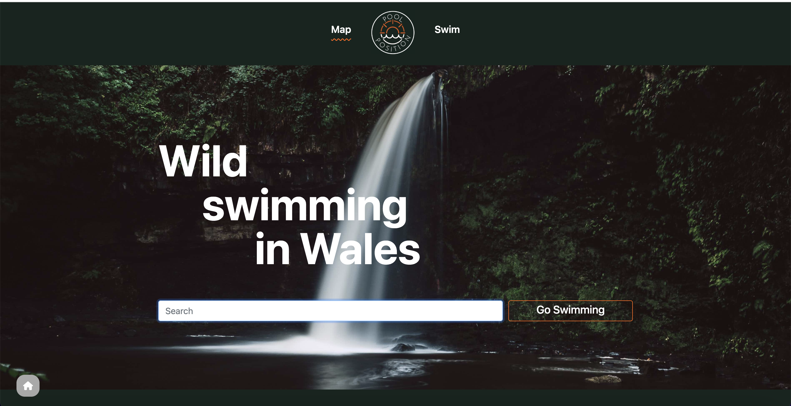

# Pool Position

## Description

An application which allows the user to search for natural swimming spots in Wales and displays those spots on a map, along with other popular places.

## Usage

To access this application, go to: https://codri5.github.io/pool-position. Type in the desired location in the search bar and select it. The app will then take the user to the map, where more information about the place, including directions will be available. If the user does not have a location in mind, they can press the 'Go Swimming' button, which will redirect the user to the map, where multiple popular spots and extra information will be available to explore. 
Another way the user can explore different spots is by pressing the 'Swim' link in the navigation bar. Multiple swimming spots, along with the weather forecast for the current day will then be displayed.

## Screenshots

## Future Development

- Expanding the search area to the whole of UK
- Adding other natural attractions
- Adding place type filter

## Contributors

Andrea Gates
Codrina Pal
Alice West